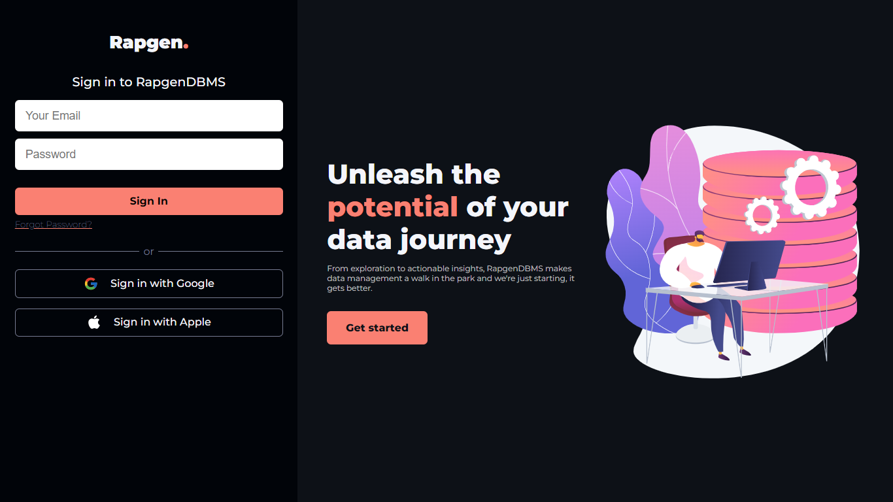

# RAPGEN DATABASE WEB APPLICATION
     

[](https://github.com/surbd)

This application is to simplify the management of RAPGEN's data, so easy access to get and modify data with roles for each individual, making the data organised.

###### Note: This web application is still in it's development phase and is open for contributions, you can fork it to your repo and make improvements to it.


## Installation

You would find the required dependencies to run RapgenDBMS on your local machine in the `requirements.txt` file.

Clone this Repo(or Fork)
```sh
git clone git@github.com:SurbD/RapgenDBMS.git
```
Create a virtual environment and activate it (use `source venv\bin\activate` for mac)
```sh
python -m venv [venv-name]
venv\Scripts\activate
```
> Make sure you create the virtual environment in the project directory

Install the dependencies and start the server.

```sh
pip install -r requirements.txt
FLASK_APP=run.py
```
```
python run.py
```
> Environments variables like the `SECRET KEY` and ` YOUR POSTGRESSQL DATABASE LOGIN DETAILS`
>  would have to be manually set, there's no production database for now.

## Technologies Used

- Flask
- Python
- PostgreSQL
- pyscopg2
- HTML
- CSS
- Javascipt
- Pandas
- SQLAlchemy

## Features

- Add data to DB as CSV or excel file
- Bulk Inserts from SQL script
- Create and Add to new Table
- Get back data in Text, CSV, Excel or PDF format
- Sort and Filter Data
- Easy Data View Dashboard
- Set user roles
- Group By Location
- Authentication for Admins Access
- Interactive UI for Updating Data (later feature)

## Later ADD ons

- Create seperate API and Frontend for better structure.
- Birthday Notification with Google Calendar.
- Bulk Message Sending Integration.
- Analytics for database growth, update timeline, region.
- Find by location with Google Maps.
